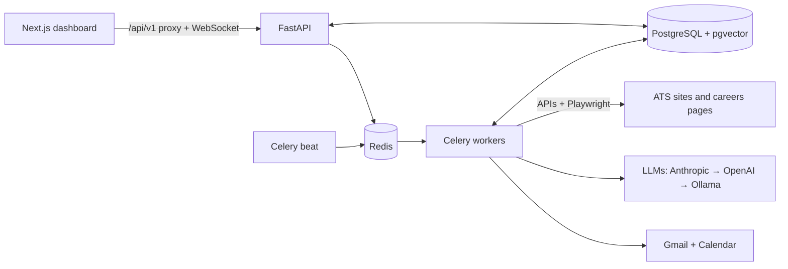

<p align="center">
  
</p>

<h1 align="center">HireFlow</h1>

<p align="center"><b>Swipe right. We apply.</b><br />An AI assistant for internship applications that runs on your own computer.</p>

<p align="center">
  <a href="https://github.com/saksham-eng560/HireFlow/actions/workflows/ci.yml"></a>
  <a href="docs/TESTING.md"></a>
  <a href="docs/TESTING.md"></a>
  <a href="LICENSE"></a>
</p>

<p align="center">
  <a href="#quick-start"><b>Quick start</b></a> ·
  <a href="#optional-add-ons">Add-ons</a> ·
  <a href="#troubleshooting">Troubleshooting</a> ·
  <a href="#how-it-works">How it works</a> ·
  <a href="docs/USER_GUIDE.md">User guide</a>
</p>

HireFlow finds internships and puts every one that matches you into a **Swipe Review** deck. For each job you keep,
it tailors your resume (truthfully), writes a cover letter and fills in the application form in a real browser,
then waits for your OK before sending. Afterwards it tracks the replies from Gmail and puts interviews on your
calendar.

Everything runs on your computer: your resume, accounts and data never leave it.

<p align="center"></p>

## Contents

1. [What it does](#what-it-does)
2. [Quick start](#quick-start): install and run it in about 10 minutes
3. [Optional add-ons](#optional-add-ons): free AI with Ollama, Sign in with Google, the Chrome extension, Gmail
4. [Everyday commands](#everyday-commands)
5. [Troubleshooting](#troubleshooting)
6. [How it works](#how-it-works) · [Safety guardrails](#safety-guardrails) · [Testing](#testing)
7. [Docs](#docs) · [License](#license)

## What it does

| | |
|---|---|
| **Finds the jobs** | Greenhouse, Lever, Ashby and Workday boards, any careers page, curated internship lists and 107 startup boards. LinkedIn, Internshala, Indeed and Glassdoor only if you turn them on. Duplicates are merged and scans repeat every few hours. |
| **Swipe Review** | Every matching job, best first, with a 0–100 score and the reasons: skills you have, skills they want, location, term and visa sponsorship. Keep or skip with a drag, a tap or the arrow keys, and undo any swipe. |
| **Tailors your resume** | Reorders and rewrites your resume for each job, checked line by line so nothing is invented, and writes a cover letter for the actual role. |
| **Fills the forms** | A real browser fills Greenhouse, Lever, Workday, LinkedIn Easy Apply and generic forms, and keeps a screenshot of each. Eligibility questions are never guessed. |
| **Tracks the replies** | Gmail replies are sorted into acknowledged, interview, assessment, rejection and offer, and each application's status follows. Interviews go on your calendar with prep notes. |
| **Uses your own logins** | An optional [Chrome extension](#chrome-extension-for-linkedin-and-internshala) hands HireFlow your LinkedIn and Internshala sessions, so it can apply there with your account. |
| **Shows what works** | Response, interview and offer rates, time to first reply, and the keywords that get callbacks. |

It works on a phone (swipe gestures, installable as an app), in light and dark mode, and with a keyboard or a
screen reader.

<table>
  <tr>
    <td width="50%"><br /><sub><b>Swipe Review.</b> Every matching internship, best first: keep or skip with a drag, a tap or ← →.</sub></td>
    <td width="50%"><br /><sub><b>Ready to submit.</b> The form is filled and stops short of Submit: check each field, fix anything, send.</sub></td>
  </tr>
  <tr>
    <td><br /><sub><b>Proof of what was sent.</b> A screenshot of the filled form, every field, the resume, cover letter and answers.</sub></td>
    <td><br /><sub><b>Onboarding.</b> Eight short steps (or one click on <i>Load sample profile</i>), then the first scan.</sub></td>
  </tr>
  <tr>
    <td><br /><sub><b>Overview.</b> What's waiting for you, what was sent, and how employers are answering.</sub></td>
    <td><br /><sub><b>Applications.</b> Every application and its status, from needs approval to offer.</sub></td>
  </tr>
  <tr>
    <td><br /><sub><b>Interviews.</b> Created from recruiter e-mails, on your calendar, with prep notes.</sub></td>
    <td><br /><sub><b>Analytics.</b> Response, interview and offer rates, and what gets callbacks.</sub></td>
  </tr>
  <tr>
    <td><br /><sub><b>Mass-apply settings.</b> One-click presets for internships, startups, new grad and India.</sub></td>
    <td><br /><sub><b>Dark theme.</b> Deep navy, still blue and white.</sub></td>
  </tr>
  <tr>
    <td colspan="2" align="center"><br /><sub><b>On a phone.</b> Swipe the card right to keep, left to skip.</sub></td>
  </tr>
</table>

Every screen and setting is explained in the [user guide](docs/USER_GUIDE.md).

## Quick start

Four steps, about 10 minutes the first time. Works on **macOS**, **Linux** and **Windows** (through WSL).

> **Pasting commands on a Mac:** paste one command at a time, exactly as shown, and press Enter after each one.

### Step 1 · Install the three tools HireFlow needs

You need **Git**, **Python 3.11 or newer** and **Node.js 20 or newer**. Check what you have:

```bash
python3 --version
```

```bash
node -v
```

If either is missing or too old, install them:

<details>
<summary><b>macOS</b></summary>

Install [Homebrew](https://brew.sh) (copy the command on its home page into Terminal), then:

```bash
brew install git python@3.12 node
```

The Python that comes with macOS is 3.9, which is too old.
</details>

<details>
<summary><b>Ubuntu, Debian or WSL</b></summary>

```bash
sudo apt update && sudo apt install -y git python3 python3-venv python3-pip nodejs npm
```

If `node -v` then shows a version below 20, install Node 20 from https://nodejs.org.
</details>

<details>
<summary><b>Windows</b></summary>

Open PowerShell, run `wsl --install` and restart the computer. Then open the **Ubuntu** app and follow the
Ubuntu instructions above. All the commands in this README go in that Ubuntu window.
</details>

### Step 2 · Download HireFlow

```bash
git clone https://github.com/saksham-eng560/HireFlow.git
```

```bash
cd HireFlow
```

### Step 3 · Start it

```bash
./start.sh
```

The first run takes 3–5 minutes: it installs everything else by itself (Python packages, the browser it fills
forms with, the dashboard) and creates a settings file called `.env`. Later starts take a few seconds.

When it's ready, your browser opens **http://localhost:3000**. Keep the terminal window open while you use
HireFlow, and press **Ctrl-C** in it to stop.

### Step 4 · Create your account and start applying

1. Click **Get started** and create your account with your email and a password. (**Continue with Google** works
   too, after a [one-time setup](#sign-in-with-google).)
2. Follow the short onboarding: upload your resume (PDF, DOCX or TXT), pick the roles and places you want, and
   answer the work-authorization questions once.
3. Run your first scan, then open **Swipe Review**: drag right (or press →) to keep a job, left (←) to skip,
   **Z** to undo.
4. Each job you keep gets a tailored resume, a cover letter and a filled-in form, then waits in **Ready to
   submit** with a screenshot. **Nothing is sent until you press Submit application.**

That's it. Your data stays in the `backend/data/` folder on your computer.

> **Want to practise first?** `./start.sh --demo` opens a separate practice copy where every job is at a
> fictional company and nothing is ever sent. Create any account there and press **Load sample profile**.

> **Used AutoApply AI before?** It's HireFlow's old name. Stop both apps, then bring your account, resumes,
> applications and saved logins over with one command (it never changes the AutoApply folder):
> `backend/.venv/bin/python scripts/import_autoapply.py ~/autoapply-ai`
> ([details](docs/SELF_HOSTING.md#coming-from-autoapply-ai)).

## Optional add-ons

HireFlow works without any of these. Add the ones you want, in any order.

| Add-on | What you get | Cost | Time |
|---|---|---|---|
| [Free AI with Ollama](#free-ai-with-ollama) | Better matching, tailored resumes and cover letters, on your own computer | Free | 10 min |
| [Sign in with Google](#sign-in-with-google) | A **Continue with Google** button on the sign-in page | Free | 5 min |
| [Chrome extension](#chrome-extension-for-linkedin-and-internshala) | Applying on LinkedIn and Internshala with your own login | Free | 5 min |
| [Gmail and Google Calendar](#gmail-and-google-calendar) | Replies and interviews tracked automatically | Free | 5 min |
| [Claude API key](#claude-api-key) | The best AI quality | Paid per use | 2 min |

Most add-ons are set up in the `.env` settings file in the HireFlow folder. To open it:

```bash
open -e .env
```

That's for a Mac, where it opens in TextEdit. On Linux or WSL use `nano .env` (save with Ctrl-O, Enter, then
exit with Ctrl-X). After saving, restart HireFlow: **Ctrl-C** in its terminal, then `./start.sh` again. If the
same setting appears twice in `.env`, the last one counts.

### Free AI with Ollama

[Ollama](https://ollama.com) is a free desktop app that runs an AI model on your own computer: no account, no
key, and nothing leaves your computer. HireFlow connects to it directly; it isn't a browser extension.

**1. Install Ollama.**

- **Mac:** download it from https://ollama.com/download, drag **Ollama** into Applications and open it once. A
  llama icon appears in the menu bar.
- **Linux or WSL:** run `curl -fsSL https://ollama.com/install.sh | sh`.

**2. Check that it's running.** This prints a version number:

```bash
curl http://localhost:11434/api/version
```

**3. Start HireFlow with Ollama.** Stop HireFlow first if it's running (**Ctrl-C**), then:

```bash
./start.sh --ollama
```

The first time, this downloads the AI model (about 3.4 GB, with a progress bar) and saves it in `.env`. After
that, plain `./start.sh` keeps using Ollama.

**4. Test it.** In HireFlow, open **Settings › Integrations**, find the **AI model** card and press **Test AI**.
The first answer is slower while the model loads.

Keep the Ollama app open whenever you use HireFlow.

**Choosing a model.** The default is `qwen3.5:4b`. To use another, set `OLLAMA_MODEL=` in `.env` and run
`./start.sh --ollama` again to download it:

| `OLLAMA_MODEL` | Download | Good for |
|---|---|---|
| `llama3.2:3b` | 2 GB | 8 GB of RAM: fastest |
| `qwen3.5:4b` (default) | 3.4 GB | 8–16 GB of RAM |
| `qwen3:8b` | 5.2 GB | 16 GB of RAM: reliable and text-only |
| `qwen3.5:9b` | 6.6 GB | 16 GB of RAM or more: the best writing |

If **Test AI** says *failed to initialize the Metal library* or *failed to allocate context*, quit Ollama from
the menu bar and open it again. If that doesn't help, switch to `qwen3:8b` (or `qwen3:4b` with 8 GB of RAM).
More models, Ollama Cloud and Docker: [docs/OLLAMA.md](docs/OLLAMA.md).

### Sign in with Google

Adds **Continue with Google** to the sign-in and sign-up pages: it signs you in, or creates your account the
first time. Because HireFlow runs on your computer, it needs its own free Google "OAuth client". You only set it
up once, and it doesn't need a payment card. Until then, the button explains what's missing and email sign-in
works as usual.

**1. Create a Google Cloud project.** Open https://console.cloud.google.com/projectcreate, name the project
`HireFlow` and press **Create**.

**2. Describe the app.** Open https://console.cloud.google.com/auth/overview. Make sure **HireFlow** is the
project selected at the top, then press **Get started** and fill in:

- **App name:** `HireFlow` · **User support email:** your email → **Next**
- **Audience:** **External** → **Next**
- **Contact information:** your email → **Next** → tick the agreement → **Create**

**3. Fill in the branding.** In the left menu, open **Branding** and check that **App name**, **User support
email** and **Developer contact information** are filled in. Leave everything else empty, and **don't upload a
logo** (a logo makes Google review the app first). Press **Save**.

**4. Let everyone sign in.** In the left menu, open **Audience**, press **Publish app**, then **Confirm**. Sign-in
only asks Google for a name and an email address, so Google doesn't need to review the app.

**5. Create the client.** In the left menu, open **Clients** → **Create client**:

- **Application type:** **Web application** · **Name:** `HireFlow on my computer`
- Under **Authorized redirect URIs**, press **Add URI** and paste exactly:
  `http://localhost:3000/api/v1/auth/google/callback`
- Press **Create**, then copy the **Client ID** and the **Client secret**.

**6. Add them to HireFlow.** Open `.env` (`open -e .env` on a Mac) and fill in these two lines, with no spaces
or quotes, then save:

```
GOOGLE_CLIENT_ID=paste-the-client-id-here
GOOGLE_CLIENT_SECRET=paste-the-client-secret-here
```

**7. Restart and try it.**

```bash
./start.sh
```

Then press **Continue with Google** at http://localhost:3000/login.

If you already have a HireFlow account with the same email, Google signs you in to that account, and your
password keeps working too. Keep the client secret in `.env` only: never share it or put it on GitHub.

### Chrome extension for LinkedIn and Internshala

**HireFlow — Session Sync** is a small Chrome extension in the [`extension/`](extension) folder of this repo. It's
only needed for **LinkedIn** and **Internshala**: they accept applications only from your own logged-in account,
so the extension hands your login there to your own HireFlow. Everything else (Greenhouse, Lever, Ashby, Workday,
careers pages, practice mode) works without it.

| | |
|---|---|
| **What it does** | Copies your LinkedIn and Internshala sessions (the login cookies) to your HireFlow, so the agent can search and apply with your account. It re-syncs every 12 hours while Chrome is open, and whenever the site renews your login. |
| **What it reads** | LinkedIn: only the `li_at` login cookie, and your public profile link from the "Me" menu. Internshala: its login cookies, only after you press **Sync Internshala session** once. It never reads your messages, other tabs or other sites. |
| **Where it sends them** | Only to the dashboard address you type in (`http://localhost:3000`), with a token that can do nothing except sync these two logins. HireFlow stores them encrypted and never shows them. |
| **Permissions Chrome shows** | Cookies and storage (to read and remember the two logins), alarms (the 12-hour re-sync), linkedin.com and internshala.com, and the one dashboard address you allow. |

LinkedIn and Internshala don't allow automation in their terms and can restrict accounts they think are
automated, so in HireFlow they stay **off until you turn them on**. Use them at your own risk.

**1. Turn the site on in HireFlow.** Open **Settings › Job sources**, scroll to **Sites that don't allow
automation**, tick *I understand the risk…* next to LinkedIn and/or Internshala, and press **Turn on**.

**2. Add the extension to Chrome.** It isn't on the Chrome Web Store; you load it from the HireFlow folder. Edge,
Brave and other Chromium browsers work the same way; Safari and Firefox don't.

1. Open a new tab and go to `chrome://extensions`.
2. Turn on **Developer mode** (the switch at the top right).
3. Press **Load unpacked** (top left) and choose the **`extension`** folder inside the HireFlow folder. On a Mac,
   press **Cmd-Shift-G** in that window, type `~/HireFlow/extension` and press **Select**.
4. **HireFlow — Session Sync** appears in the list. Click the puzzle-piece icon in Chrome's toolbar and pin it,
   so its blue "H" stays visible.

Keep the HireFlow folder where it is: Chrome loads the extension from it.

**3. Connect it to HireFlow** (HireFlow must be running):

1. In HireFlow, open **Settings › Integrations**. On the **LinkedIn — Chrome extension** card, press **Generate
   extension token**, then copy the token with the copy button.
2. Click the blue "H" in Chrome's toolbar and fill in **Dashboard URL** `http://localhost:3000` and **Extension
   token** (paste it).
3. Press **Save settings**, then **Allow** when Chrome asks to let the extension reach `localhost:3000`.

**4. Sync your logins.**

- **LinkedIn:** log in at https://www.linkedin.com in the same Chrome, open the extension and press **Sync
  LinkedIn session**.
- **Internshala:** log in at https://internshala.com, open the extension and press **Sync Internshala session**.
  To let the agent fill and send Internshala applications too, turn on **Let the agent apply on Internshala** on
  the **Internshala — apply bot** card in **Settings › Integrations** (read the warning first).

The popup and **Settings › Integrations** now show **Session synced** with the time of the last sync.

**Updating, and removing it**

- **After `git pull`:** open `chrome://extensions` and press the reload icon on the extension's card.
- **Token:** it works for 180 days. When the extension says "Token rejected", generate a new one (step 3).
- **Disconnect:** press **Disconnect** on the card in **Settings › Integrations** to delete a synced login from
  HireFlow. To remove the extension itself, press **Remove** on its card in `chrome://extensions`.
- In practice mode (`./start.sh --demo`) the extension is turned off.

More detail, including how the Internshala bot fills forms: [user guide](docs/USER_GUIDE.md#linkedin-internshala-and-the-chrome-extension).

### Gmail and Google Calendar

Tracks replies, rejections and interview invites from your inbox and puts interviews on your calendar. It uses
the same Google client as [Sign in with Google](#sign-in-with-google), plus the Gmail and Calendar APIs and
permissions. Step by step: [user guide](docs/USER_GUIDE.md#connect-gmail-and-google-calendar). Then press
**Settings › Integrations › Connect Google account**.

### Claude API key

For the best tailoring, cover letters and answers, create a key at https://console.anthropic.com. Put it in
`.env` as `ANTHROPIC_API_KEY=your-key` and restart HireFlow. It's paid per use, and each user has a daily AI
budget. With Ollama set up too, see [which one goes first](docs/OLLAMA.md#switch-models-or-turn-it-off).

## Everyday commands

Run these in the HireFlow folder.

| Command | What it does |
|---|---|
| `./start.sh` | Start HireFlow at http://localhost:3000 |
| **Ctrl-C** | Stop it (in the terminal where it runs) |
| `git pull` then `./start.sh` | Update to the latest version (only what changed is reinstalled) |
| `./start.sh --ollama` | Start with the free local AI (only needed the first time) |
| `./start.sh --demo` | Practice mode: fictional jobs, nothing really sent, its own database |
| `./start.sh --prod` | Faster pages (builds the dashboard first) |
| `./start.sh --reset` | Start over with an empty database |
| `./start.sh --docker` | Run everything in Docker instead; `./start.sh --stop` stops it |
| `open -e .env` | Open the settings file (on a Mac) |

## Troubleshooting

<details>
<summary><b>Starting HireFlow</b></summary>

| You see | Do this |
|---|---|
| `Python 3.11+ is required` / `Node.js 20+ is required` | Install a newer version: [Step 1](#step-1--install-the-three-tools-hireflow-needs). |
| `Unknown option: #` or `zsh: unknown file attribute` | Paste only the command itself, one per line, without any note after it. |
| `Port 3000 is already in use` | Close the other app (or an earlier HireFlow), or start with `WEB_PORT=3001 ./start.sh`. Same for 8000 with `API_PORT`. |
| `Chromium install failed` | Run `backend/.venv/bin/python -m playwright install chromium` (on Linux add `--with-deps`). |
| "Can't reach the HireFlow server right now" | The API isn't running: look for an error in the terminal, or in `logs/api.log`. |
| Forgot your password | `backend/.venv/bin/python scripts/account.py reset-password you@example.com` |
| "Invalid email or password" for an account you know exists | Each copy of the folder has its own accounts: `backend/.venv/bin/python scripts/account.py where` finds yours. |
</details>

<details>
<summary><b>The browser</b></summary>

| You see | Do this |
|---|---|
| The tab shows an old or different icon | Your browser kept an icon from something that ran on `localhost:3000` before. **Safari:** quit it, delete the folder `~/Library/Safari/Favicon Cache` (Finder › **Go › Go to Folder…**), open Safari again. **Chrome:** `chrome://settings/clearBrowserData` → **Cached images and files** → **Clear data**, then reload with **Cmd-Shift-R**. |
</details>

<details>
<summary><b>Ollama</b></summary>

| You see | Do this |
|---|---|
| `Ollama isn't running` | Open the Ollama app (Mac) or run `ollama serve` (Linux). |
| `failed to initialize the Metal library` or `failed to allocate context` | Quit Ollama from the menu bar and open it again (`ollama ps` shows loaded models, `ollama stop <model>` unloads one). Still failing: set `OLLAMA_MODEL=qwen3:8b` in `.env` (or `qwen3:4b` with 8 GB of RAM) and run `./start.sh --ollama`. |
| Test AI is slow or times out | The first answer is slow while the model loads. If it stays slow, pick a smaller model ([table](#free-ai-with-ollama)). |

More: [docs/OLLAMA.md](docs/OLLAMA.md#troubleshooting).
</details>

<details>
<summary><b>Sign in with Google</b></summary>

| You see | Do this |
|---|---|
| "Google sign-in isn't set up on this computer yet" | Do the [Sign in with Google](#sign-in-with-google) steps, then restart HireFlow. |
| Google asks for branding before publishing | Fill in **Branding** (step 3), without a logo, and press **Save**. |
| `Error 400: redirect_uri_mismatch` | The redirect URI in the Google client must be exactly `http://localhost:3000/api/v1/auth/google/callback`. |
| "Access blocked" or "app is in testing" | Publish the app (step 4), or add the Gmail address under **Audience › Test users**. |
</details>

<details>
<summary><b>Chrome extension</b></summary>

| You see | Do this |
|---|---|
| No **Load unpacked** button | Turn on **Developer mode** (top right of `chrome://extensions`). |
| "Token rejected" | Generate a new token in **Settings › Integrations** and paste it again. |
| "Permission to contact your dashboard was denied" | Press **Save settings** again and choose **Allow**. |
| "Session expired" in Settings › Integrations | Log in to the site in Chrome again and press **Sync** in the extension. |
</details>

Anything else: the logs are in the `logs/` folder (`api.log`, `web.log`).

## How it works



The API stays fast because everything slow (scans, AI calls, a browser filling a form) runs in background
workers with retries. On your own computer, `./start.sh` uses SQLite and runs those tasks in-process, so you
don't need PostgreSQL or Redis. The full journey of one application, and how the AI fallback works:
[docs/ARCHITECTURE.md](docs/ARCHITECTURE.md).

| | |
|---|---|
| Dashboard | Next.js 15, React 19, TypeScript, Tailwind CSS, Radix UI (shadcn/ui), SWR, framer-motion, Recharts |
| API | Python 3.11+, FastAPI, SQLAlchemy 2, Alembic, Pydantic, slowapi |
| Data | PostgreSQL 16 + pgvector (SQLite locally), Redis, local disk or S3 / Cloudflare R2 |
| Workers | Celery + beat, Playwright (Chromium) |
| AI | Anthropic, OpenAI or Ollama, with JSON-schema outputs and a rule-based fallback |
| Quality | pytest, Playwright, axe-core, ruff, bandit, ESLint, pip-audit, npm audit, gitleaks, GitHub Actions |

## Safety guardrails

Applying for someone is only useful if it never embarrasses them. The server enforces these, not just the
screens:

<p align="center"></p>

- **You pick every job.** Nothing is prepared for a job you didn't keep, and nothing is sent until you approve it
  (unless you turn on "Submit automatically").
- **Limits:** a 10-minute undo window on every automatic send, a daily cap (never above 25), at most 3
  applications per company a week, and never the same job twice.
- **Never guesses, never invents.** Eligibility answers are never guessed or sent to an AI, and a truthfulness
  check reverts anything that isn't on your resume.
- **Job posts are data, not instructions** (prompt-injection defences); every AI reply is validated, and each user
  has a daily AI budget.
- **Proof of what was sent:** a screenshot before every submit, AI-written answers labelled and editable, a dry-run
  mode, and one switch that pauses everything.
- **Site rules respected:** sites that forbid automation stay off unless you opt in, with rate limits and back-off.
- **Your data:** secrets encrypted at rest, CSRF and upload checks, no personal data in logs; download everything
  or delete your account at any time.

Details: [docs/ARCHITECTURE.md](docs/ARCHITECTURE.md#guardrails-and-where-theyre-enforced) ·
[docs/SECURITY.md](docs/SECURITY.md).

## Testing

```bash
make test        # backend tests (pytest), including real-browser tests
make e2e-demo    # Playwright through the dashboard in demo mode
make lint        # ruff, ESLint, TypeScript, colour contrast
make metrics     # measure the numbers below
```

Measured with `scripts/metrics.py`, not guessed: **455 backend tests (81% coverage) and 19 end-to-end tests**. On
the demo careers site, the first scan takes about 0.3 s, sign-up to the first Swipe Review deck takes under a
second of server time (about 5 s through the UI), and 12 of 12 forms are filled with every required field. CI runs
all of it, plus migrations, security audits and Docker builds, on every push: [docs/TESTING.md](docs/TESTING.md).

## Running it on a server

HireFlow is built to run on your own computer. To keep it running around the clock, put it on a server with
Docker Compose and automatic HTTPS: one command on a fresh Ubuntu machine, including Oracle Cloud's free tier.
See [docs/SELF_HOSTING.md](docs/SELF_HOSTING.md#on-your-own-server-optional).

## Roadmap

- A 60-second walkthrough video.
- Dedicated submitters for Ashby, SmartRecruiters and iCIMS (today they go through the generic form engine).
- Fair per-user queues and a separate browser-worker pool for many users.
- Browser-extension autofill for applications you fill in yourself.
- More languages and regions beyond the India and US presets.

## Docs

| | |
|---|---|
| [User guide](docs/USER_GUIDE.md) | Every screen and setting |
| [Free AI with Ollama](docs/OLLAMA.md) | Models, Ollama Cloud, Docker, troubleshooting |
| [AI models](docs/AI_MODELS.md) | Claude, OpenAI and Ollama compared |
| [Running and self-hosting](docs/SELF_HOSTING.md) | Docker, development setup, your own server, coming from AutoApply AI |
| [Architecture](docs/ARCHITECTURE.md) | How the pieces fit, and where each guardrail lives |
| [Testing](docs/TESTING.md) | What's tested, and the measured numbers |
| [Security and responsible use](docs/SECURITY.md) | How your data is protected, and the rules for using job sites |
| [The plan](docs/HIREFLOW_PLAN.md) | How AutoApply AI became HireFlow |

## License

[MIT](LICENSE)
