<p align="center">
  
</p>

<h1 align="center">HireFlow</h1>

<p align="center"><b>Swipe right. We apply.</b> An AI internship-application assistant that you run yourself.</p>

<p align="center">
  <a href="https://github.com/saksham-eng560/HireFlow/actions/workflows/ci.yml"></a>
  <a href="docs/TESTING.md"></a>
  <a href="docs/TESTING.md"></a>
  <a href="LICENSE"></a>
</p>

HireFlow finds internships, puts every one that passes your filters into a **Swipe Review** deck, and for each
job you keep it tailors your resume (truthfully), writes a cover letter, fills the application form in a real
browser and applies, then tracks the replies from Gmail and puts interviews on your calendar.

It runs on your own computer: your resume, accounts and data never leave it. **Start it with one command**
([Quick start](#quick-start)): `./start.sh`, then create your account at http://localhost:3000 (email, or
**Continue with Google**).

<p align="center">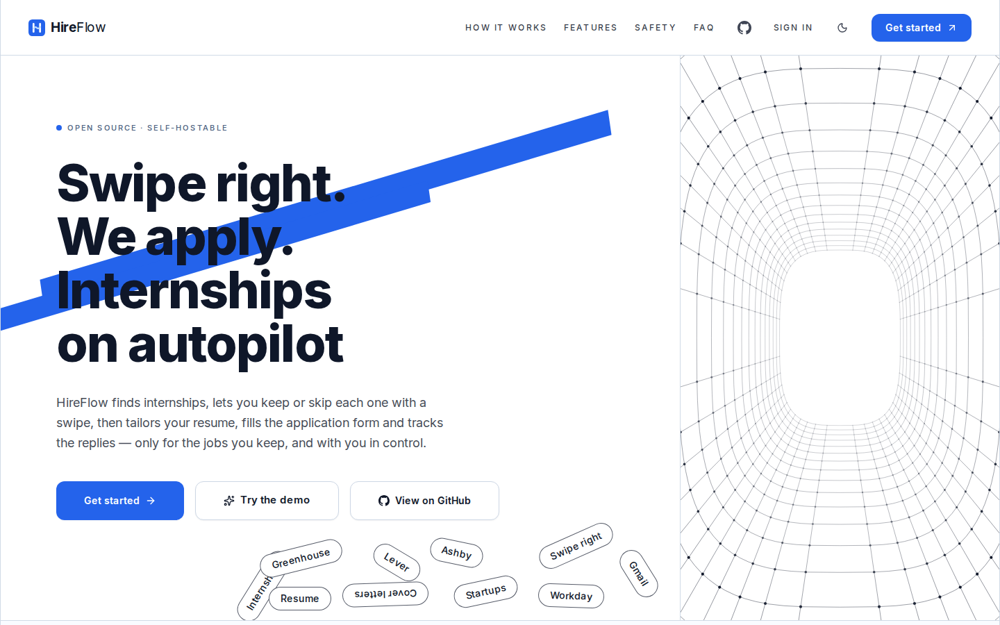</p>

<table>
  <tr>
    <td width="50%">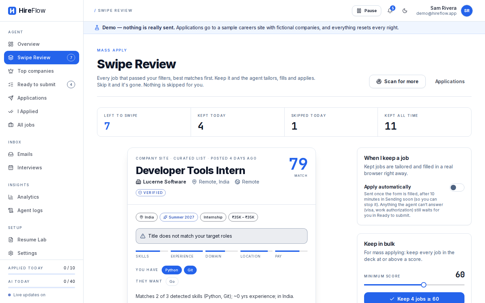<br /><sub><b>Swipe Review.</b> Every matching internship, best first: keep or skip with a drag, a tap or ← →.</sub></td>
    <td width="50%">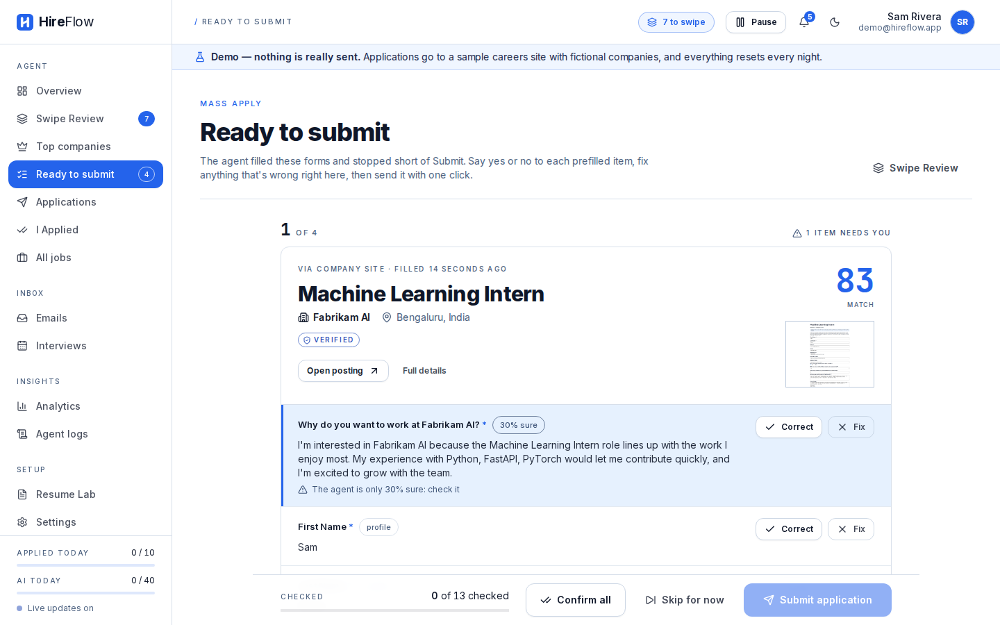<br /><sub><b>Ready to submit.</b> The agent filled the form and stopped short of Submit: check each field, fix anything, send.</sub></td>
  </tr>
  <tr>
    <td>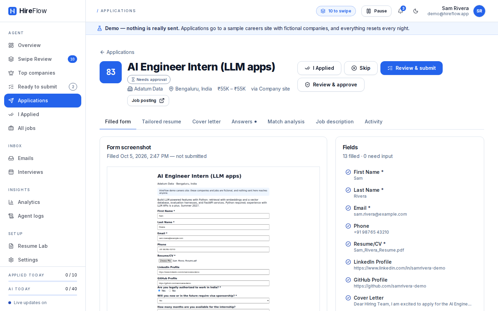<br /><sub><b>Proof of what was sent.</b> A screenshot of the filled form and every field, plus the tailored resume, cover letter and answers.</sub></td>
    <td>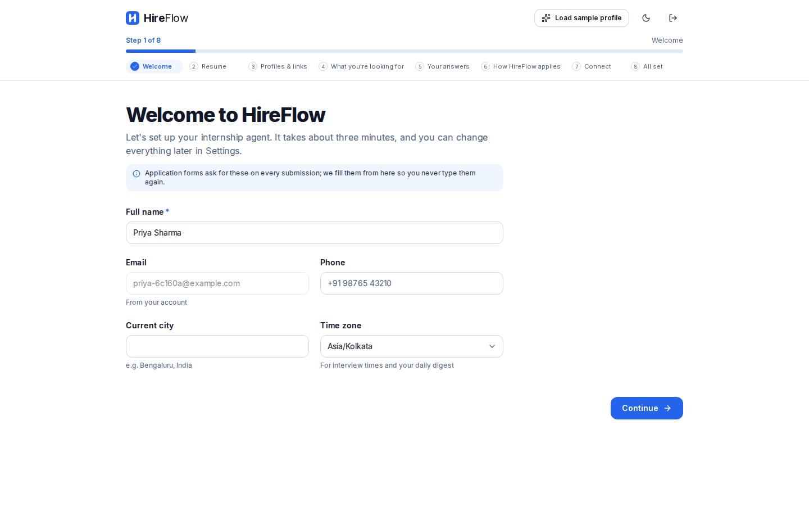<br /><sub><b>Onboarding.</b> Eight short steps (or one click on <i>Load sample profile</i>), then the first scan.</sub></td>
  </tr>
  <tr>
    <td>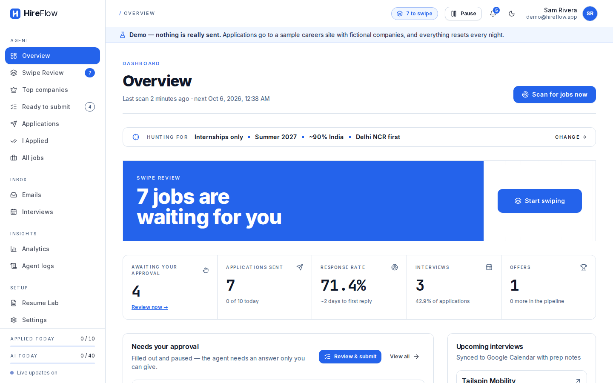<br /><sub><b>Overview.</b> What's waiting for you, what was sent, and how employers are answering.</sub></td>
    <td>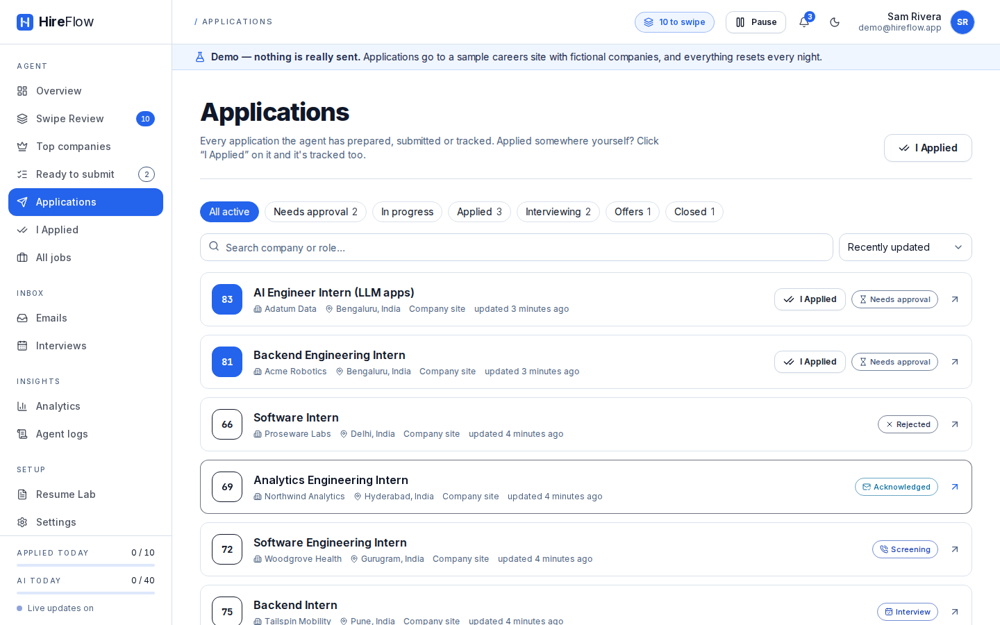<br /><sub><b>Applications.</b> Every application and its status, from needs approval to offer.</sub></td>
  </tr>
  <tr>
    <td>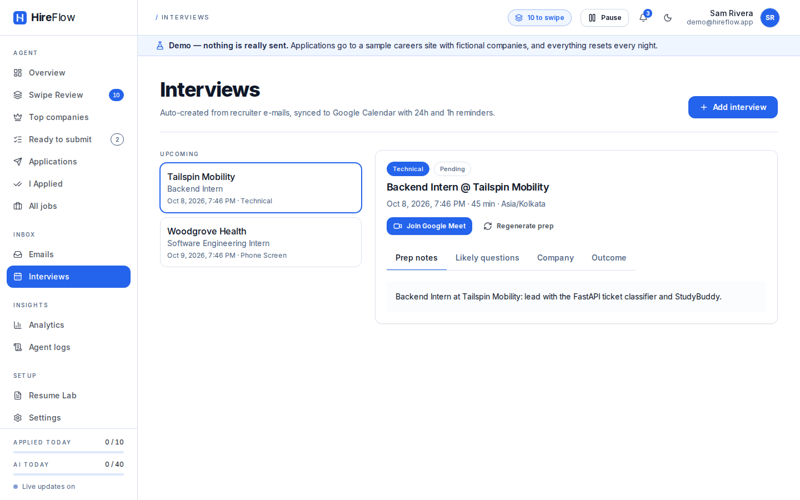<br /><sub><b>Interviews.</b> Created from recruiter e-mails, on your calendar, with prep notes.</sub></td>
    <td>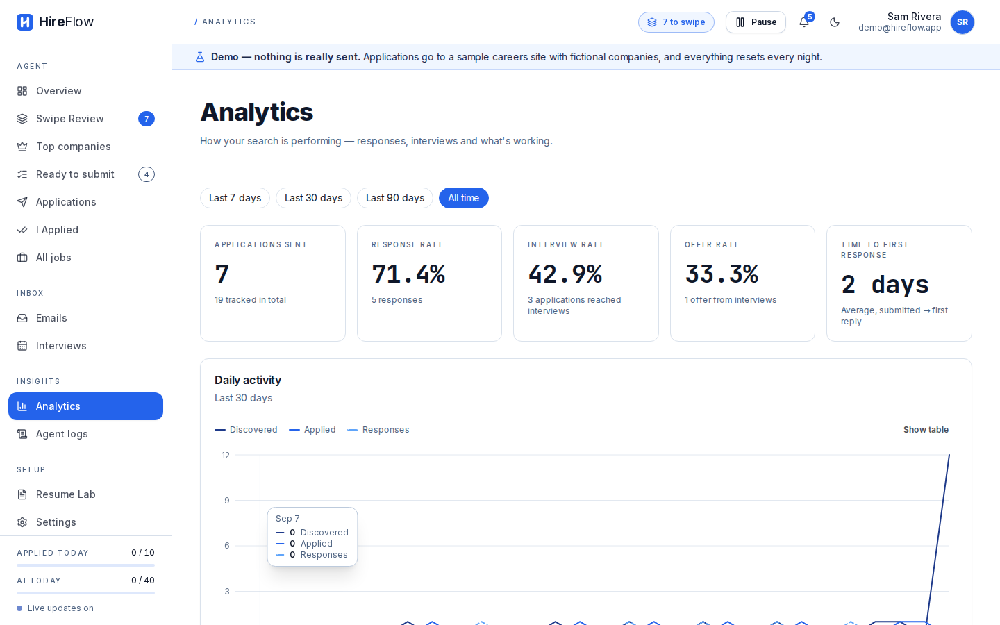<br /><sub><b>Analytics.</b> Response, interview and offer rates, and what gets callbacks.</sub></td>
  </tr>
  <tr>
    <td>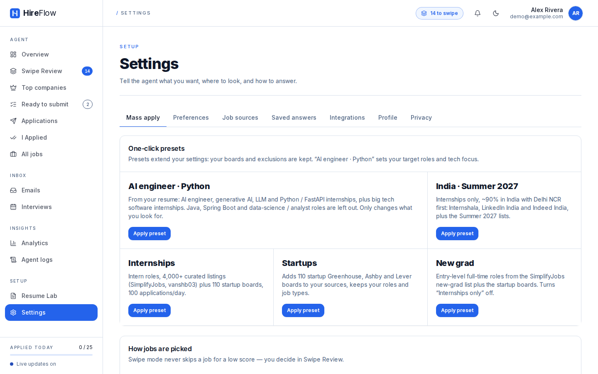<br /><sub><b>Mass-apply settings.</b> One-click presets for internships, startups, new grad and India.</sub></td>
    <td>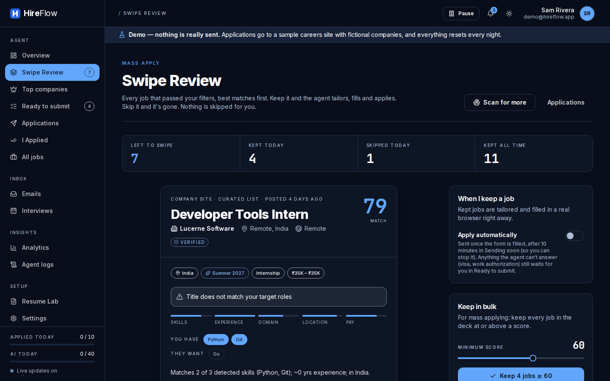<br /><sub><b>Dark theme.</b> Deep navy, still blue and white.</sub></td>
  </tr>
  <tr>
    <td colspan="2" align="center">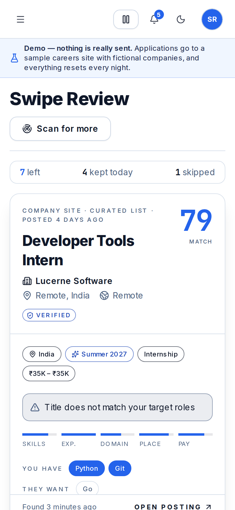<br /><sub><b>On a phone.</b> Swipe the card right to keep, left to skip.</sub></td>
  </tr>
</table>

## Features

- **Finds the jobs.** Greenhouse, Lever, Ashby and Workday boards through their public APIs, any careers page
  (schema.org `JobPosting` data), curated internship lists, 107 startup boards with one click, and, only if you
  opt in, LinkedIn, Internshala, Indeed and Glassdoor. Duplicates are merged; scans run every few hours.
- **Swipe Review.** Every job that passed your filters, best match first, with a 0–100 score and why: the
  skills you have, the ones they want, location, term and visa sponsorship. Drag, tap or use ← →; undo any
  swipe; keep everything above a score in one click.
- **Resume tailoring, without inventing anything.** Your original file, light reordering, or full AI
  tailoring checked line by line against your master resume, plus a cover letter for the actual role.
- **Form filling across ATSs.** A real browser fills Greenhouse, Lever, Workday, LinkedIn Easy Apply and
  generic forms, with a screenshot of every filled form. Eligibility questions are never guessed.
- **Gmail and Calendar.** Replies are classified (acknowledged, interview, assessment, rejection, offer) and
  each application's status follows; interviews go on your calendar with prep notes.
- **Analytics.** Pipeline by status, response, interview and offer rates, time to first reply, which platforms
  answer, and the keywords that get callbacks.
- **Onboarding in minutes**, a sample profile to try it, and a guided first scan.
- **Works on your phone** (swipe gestures, installable as an app), in light and dark, and with a keyboard or a
  screen reader (no serious axe-core findings on any page).

The full tour, with every setting: [docs/USER_GUIDE.md](docs/USER_GUIDE.md).

## Architecture

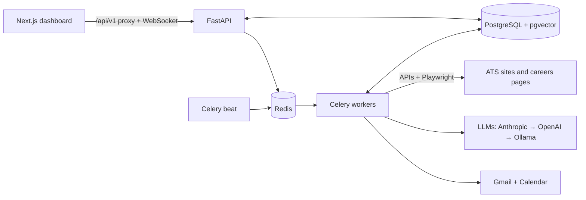

The API stays fast because everything slow (scans, AI calls, a browser filling a form) runs on Celery queues,
with retries and crash-safe hand-offs. One application's whole journey, why Celery and Playwright, and how the
LLM fallback works: [docs/ARCHITECTURE.md](docs/ARCHITECTURE.md).

## Tech stack

| | |
|---|---|
| Dashboard | Next.js 15, React 19, TypeScript, Tailwind CSS, Radix UI (shadcn/ui), SWR, framer-motion, Recharts |
| API | Python 3.11+, FastAPI, SQLAlchemy 2, Alembic, Pydantic, slowapi |
| Data | PostgreSQL 16 + pgvector (SQLite for local use), Redis, local disk or S3 / Cloudflare R2 |
| Workers | Celery + beat, Playwright (Chromium) |
| AI | Anthropic, OpenAI or Ollama, with JSON-schema outputs and a heuristic fallback |
| Quality | pytest, Playwright e2e, axe-core, ruff, bandit, ESLint, pip-audit, npm audit, gitleaks, GitHub Actions |

## Quick start

Works on **macOS, Linux and Windows (with WSL)**. You need **Git**, **Python 3.11+** and **Node.js 20+**.
Everything else is optional:

| | Needed? | What it adds | Set up in |
|---|---|---|---|
| Git, Python, Node.js | **Yes** | Runs HireFlow (`./start.sh` installs the rest itself, including the browser it fills forms with) | [below](#1-get-it) |
| Ollama (a desktop app) | No | Free AI on your own computer: better matching, tailored resumes, cover letters | [step 4](#4-free-ai-with-ollama-optional) |
| HireFlow Chrome extension | No | Only for LinkedIn and Internshala: lets the agent use your own login there | [step 5](#5-chrome-extension-for-linkedin-and-internshala-optional) |
| A Google OAuth client (free) | No | **Continue with Google** on the sign-in page; later, Gmail and Calendar tracking | [step 6](#6-sign-in-with-google-optional) |
| Claude API key | No | The best AI for tailoring, cover letters and answers | [step 7](#7-other-add-ons-optional) |

> **Copying commands on a Mac:** paste one command at a time, as shown. Don't add notes after a `#` on the
> same line: the Mac's shell (zsh) doesn't treat them as comments.

<details>
<summary><b>Don't have them yet?</b> (click)</summary>

- **macOS:** install [Homebrew](https://brew.sh), then `brew install git python@3.12 node`.
  (The Python that comes with macOS is 3.9: too old.)
- **Ubuntu / Debian / WSL:** `sudo apt update && sudo apt install -y git python3 python3-venv python3-pip nodejs npm`,
  then check `node -v` says 20 or newer (if not, install Node 20 from https://nodejs.org).
- **Windows:** install [WSL](https://learn.microsoft.com/windows/wsl/install) (`wsl --install` in PowerShell, then
  restart), open **Ubuntu** and follow the Ubuntu line above. Or, with Docker Desktop only: `start.bat`.

Check with `python3 --version` and `node -v`.
</details>

### 1. Get it

```bash
git clone https://github.com/saksham-eng560/HireFlow.git
cd HireFlow
```

### 2. Start it

```bash
./start.sh
```

The first run takes 3–5 minutes: it installs everything (Python packages, a Chromium browser for form filling, the
dashboard) and creates `.env` with fresh secrets. Later runs start in seconds. Your browser opens
**http://localhost:3000**; keep the terminal open while you use it and press **Ctrl-C** there to stop.

### 3. Create your account and set up your agent

1. Click **Get started**. Create your account with your email and a password, or press **Continue with Google**
   (it needs a one-time setup first: [step 6](#6-sign-in-with-google-optional)).
2. Follow the onboarding: upload your resume (PDF, DOCX or TXT), pick your target roles and places, and save your
   work-authorization answers.
3. Run the first scan, then open **Swipe Review**: keep a job (drag right or press →), skip one (←), undo with **Z**.
4. Each job you keep gets a tailored resume and cover letter and a filled application form, then waits in **Ready to
   submit** with a screenshot of the form. Nothing is sent until you press **Submit application**.

Your data stays in `backend/data/` on your computer.

> **Used AutoApply AI before?** (HireFlow's old name.) Bring your account, resumes, applications and saved logins
> over with one command, after stopping both apps:
> `backend/.venv/bin/python scripts/import_autoapply.py ~/autoapply-ai`
> ([details](docs/SELF_HOSTING.md#coming-from-autoapply-ai)). It never changes the AutoApply folder.

> **Want to practise first?** `./start.sh --demo` starts a separate practice copy with its own database: scans find
> fictional companies on a bundled careers site, and nothing is ever sent. Create any account there (press **Load
> sample profile** in onboarding); it's wiped every night. Plain `./start.sh` is your real account.

### 4. Free AI with Ollama (optional)

HireFlow works without any AI, on built-in matching and templates. For better matching, tailoring and cover
letters, run a free AI model on your own computer with [Ollama](https://ollama.com): no account, no key, and
nothing leaves your computer. Ollama is a **desktop app**, not a browser extension: HireFlow talks to it directly.

1. **Install Ollama.**
   - **Mac:** download it from https://ollama.com/download, drag **Ollama** to Applications and open it once. A
     llama icon appears in the menu bar: it's running.
   - **Linux / WSL:** run `curl -fsSL https://ollama.com/install.sh | sh` (it starts by itself).
   - **Windows:** run HireFlow in WSL and install Ollama there with the Linux line above.
2. **Check it's running** (it prints a version number):

   ```bash
   curl http://localhost:11434/api/version
   ```

3. **Start HireFlow with it.** Stop HireFlow first if it's running (**Ctrl-C**), then:

   ```bash
   ./start.sh --ollama
   ```

   The first time, it downloads the AI model `qwen3.5:4b` (about 3.4 GB, with a progress bar; good for a computer
   with 8–16 GB of RAM) and saves the choice in `.env`. After that, plain `./start.sh` (or `./start.sh --demo`)
   keeps using it: you only need `--ollama` once.
4. **Test it.** In the dashboard, open **Settings › Integrations**, find the **AI model** card and press
   **Test AI**. It shows the model's answer and how long it took. The first answer is slower while the model
   loads.

Keep the Ollama app running whenever you use HireFlow: `./start.sh` warns you if it isn't, and `./start.sh --ollama`
opens it for you on a Mac.
A smaller model for 8 GB of RAM, a bigger one for 16 GB+, Ollama in Docker, Ollama Cloud and troubleshooting:
**[docs/OLLAMA.md](docs/OLLAMA.md)**.

### 5. Chrome extension for LinkedIn and Internshala (optional)

You **don't** need this for anything else: Greenhouse, Lever, Ashby, Workday, careers pages and the demo all work
without it. LinkedIn and Internshala only accept applications from your own logged-in account, so the HireFlow
extension copies your login there (the session cookie) to your own HireFlow. It sends it nowhere else.

These sites don't allow automation in their terms and can restrict accounts they think are automated, so they're
**off until you turn them on**. Use them at your own risk.

**A. Turn the site on in HireFlow.** Open **Settings › Job sources**, scroll to **Sites that don't allow
automation**, tick *I understand the risk…* next to LinkedIn and/or Internshala, and press **Turn on**.

**B. Add the extension to Chrome** (Edge, Brave and other Chromium browsers work the same way; Safari and
Firefox don't):

1. Open a new tab and go to `chrome://extensions`.
2. Turn on **Developer mode** (the switch at the top right).
3. Click **Load unpacked** (top left) and choose the **`extension`** folder inside your HireFlow folder.
   On a Mac, press **Cmd-Shift-G** in that window and type `~/HireFlow/extension`, then **Select**.
4. **HireFlow — Session Sync** appears in the list. Click the puzzle-piece icon in Chrome's toolbar and pin
   **HireFlow** so its blue "H" icon stays visible.

Keep the HireFlow folder where it is: Chrome loads the extension from it.

**C. Connect the extension to HireFlow** (HireFlow must be running):

1. In HireFlow, open **Settings › Integrations**, find the **LinkedIn — Chrome extension** card and press
   **Generate extension token**. Copy the token with the copy button.
2. Click the HireFlow icon in Chrome's toolbar. Enter:
   - **Dashboard URL:** `http://localhost:3000`
   - **Extension token:** paste the token
3. Press **Save settings**, then **Allow** when Chrome asks to let the extension reach `localhost:3000`.

**D. Sync your login.**

- **LinkedIn:** log in at https://www.linkedin.com in the same Chrome, open the extension and press
  **Sync LinkedIn session**.
- **Internshala:** log in at https://internshala.com, open the extension and press **Sync Internshala
  session**. To let the agent apply there too, turn on **Let the agent apply on Internshala** on the
  **Internshala — apply bot** card in **Settings › Integrations** and read the warning.

**Settings › Integrations** now shows **Session synced**. While Chrome is open, the extension re-syncs every 12
hours and whenever the site renews your login. The token works for 180 days and can only sync these two logins;
press **Disconnect** on the card to remove a synced login. After `git pull`, press the reload icon on the
extension's card in `chrome://extensions`. The extension is turned off in the demo. More:
[docs/USER_GUIDE.md](docs/USER_GUIDE.md#linkedin-internshala-and-the-chrome-extension).

### 6. Sign in with Google (optional)

**Continue with Google** signs you in with your Google account, or creates your HireFlow account the first time.
HireFlow runs on your computer, so it needs its own free Google "OAuth client" (a one-time setup of about five
minutes; no payment or card). Until then, the button explains this and email sign-in works as usual.

1. Open https://console.cloud.google.com/projectcreate, name the project `HireFlow` and press **Create**.
2. Open https://console.cloud.google.com/auth/overview (make sure the **HireFlow** project is selected at the top)
   and press **Get started**:
   - **App name:** `HireFlow`; **User support email:** your email. **Next**.
   - **Audience:** **External**. **Next**.
   - **Contact information:** your email. **Next**, tick the agreement, **Create**.
3. Open **Audience** in the left menu and press **Publish app**, then **Confirm**. (Sign-in only asks Google for your
   name and email address, so no review by Google is needed. Or leave it in *Testing* and add your Gmail address
   under **Test users**.)
4. Open **Clients** in the left menu, press **Create client** and choose:
   - **Application type:** **Web application**; **Name:** `HireFlow on my computer`.
   - Under **Authorized redirect URIs** press **Add URI** and paste exactly:
     `http://localhost:3000/api/v1/auth/google/callback`
   - Press **Create**. Copy the **Client ID** and the **Client secret** shown.
5. Open `.env` in the HireFlow folder in a text editor (on a Mac: `open -e .env`) and fill in these two lines:

   ```bash
   GOOGLE_CLIENT_ID=paste-the-client-id-here
   GOOGLE_CLIENT_SECRET=paste-the-client-secret-here
   ```

6. Restart HireFlow (**Ctrl-C**, then `./start.sh`). **Continue with Google** now opens Google's sign-in.

The same client also connects Gmail and Google Calendar later, to track replies and interviews
([how](docs/USER_GUIDE.md#connect-gmail-and-google-calendar)). Keep the client secret in `.env` only: never share
it or put it in git. If you've already signed up with the same email and a password, Google signs you in to that
same account, and your password keeps working too.

### 7. Other add-ons (optional)

| Add-on | What it adds | How |
|---|---|---|
| **Claude API key** | The best AI for tailoring, cover letters and answers (paid, per use) | Create a key at https://console.anthropic.com, open `.env` in a text editor, set `ANTHROPIC_API_KEY=` to it, restart. With Ollama set up too, see [which goes first](docs/OLLAMA.md#switch-models-or-turn-it-off). |
| **Gmail and Google Calendar** | Replies, rejections and interview invites tracked from your inbox; interviews on your calendar | With the Google client from [step 6](#6-sign-in-with-google-optional), enable the Gmail and Calendar APIs, then **Settings › Integrations › Connect Google account**. Step by step: [docs/USER_GUIDE.md](docs/USER_GUIDE.md#connect-gmail-and-google-calendar). |
| **Practice careers site** | A fake company with real forms, to watch the whole loop before applying for real | `./start.sh --sample`, then follow [docs/USER_GUIDE.md](docs/USER_GUIDE.md#try-the-whole-loop-on-the-sample-careers-site). |

Restart means **Ctrl-C** in the HireFlow terminal, then `./start.sh` again. Keys stay in `.env` on your computer:
never share them or put them in git.

### Everyday commands

| Command | What it does |
|---|---|
| `./start.sh` | Start HireFlow (your own account) at http://localhost:3000 |
| `./start.sh --demo` | Practice mode: its own database, fictional jobs, nothing really sent |
| `./start.sh --ollama` | Start with a free local AI model (combine with `--demo`) |
| `./start.sh --prod` | Faster pages: builds the dashboard first |
| `./start.sh --reset` | Start with an empty database (with `--demo`: a fresh demo) |
| `./start.sh --docker` | Run everything in Docker instead (PostgreSQL, Redis, workers); `./start.sh --stop` stops it |
| **Ctrl-C** | Stop (in the terminal where it runs) |
| `git pull` then `./start.sh` | Update to the latest version (it reinstalls only what changed) |

<details>
<summary><b>Something not working?</b> (click)</summary>

| You see | Do this |
|---|---|
| `Python 3.11+ is required` | Install a newer Python (see *Don't have them yet?* above). |
| `Node.js 20+ is required` | Install Node 20 or newer. |
| `Port 3000 is already in use` | Another app (or an earlier HireFlow) uses it: close it, or `WEB_PORT=3001 ./start.sh`. Same for 8000 with `API_PORT`. |
| "Can't reach the HireFlow server right now" in the browser | The API isn't running: look at the terminal for an error, or check `logs/api.log`. |
| `Chromium install failed` | Form filling needs it. Run `backend/.venv/bin/python -m playwright install chromium` (on Linux add `--with-deps`). |
| `Unknown option: #` or `zsh: unknown file attribute` | You pasted a note after a command. Paste only the command itself, one per line. |
| The browser tab shows an old or different icon | Your browser kept an icon from something that ran on `localhost:3000` before. **Safari:** quit Safari, delete the folder `~/Library/Safari/Favicon Cache` (in Finder: **Go › Go to Folder…**), and open Safari again. **Chrome:** open `chrome://settings/clearBrowserData`, tick **Cached images and files**, **Clear data**, then reload with **Cmd-Shift-R**. To check quickly, open http://127.0.0.1:3000: it shows the blue "H". |
| Google says `Error 400: redirect_uri_mismatch` | In the Google client, the redirect URI must be exactly `http://localhost:3000/api/v1/auth/google/callback` (with another `WEB_PORT`, use that port). |
| Google says "Access blocked" or that the app is in testing | Publish the app (step 6.3), or add your Gmail address under **Audience › Test users**. |
| "Google sign-in isn't set up on this computer yet" | Do [step 6](#6-sign-in-with-google-optional), then restart HireFlow. |
| `Ollama isn't running` | Open the Ollama app (Mac) or run `ollama serve`. More in [docs/OLLAMA.md](docs/OLLAMA.md#troubleshooting). |
| Test AI is slow or times out | Normal for the first answer while the model loads. If it stays slow, use a smaller model: [docs/OLLAMA.md](docs/OLLAMA.md#which-model-to-choose). |
| No **Load unpacked** button in `chrome://extensions` | Turn on **Developer mode** (top right). |
| Extension says "Token rejected" | Generate a new token in **Settings › Integrations** and paste it into the extension again. |
| Extension says "Permission to contact your dashboard was denied" | Press **Save settings** again and choose **Allow**. |
| "Session expired" in Settings › Integrations | Log in to LinkedIn (or Internshala) in Chrome again and press **Sync** in the extension. |
| Forgot your password | `backend/.venv/bin/python scripts/account.py reset-password you@example.com` |
| Anything else | Logs are in `logs/` (`api.log`, `web.log`). |
</details>

More: [running with Docker, development setup and your own server](docs/SELF_HOSTING.md) ·
[AI models](docs/AI_MODELS.md).

## Guardrails

Applying for someone is only useful if it never embarrasses them. These are enforced by the server, not just
the UI:

<p align="center">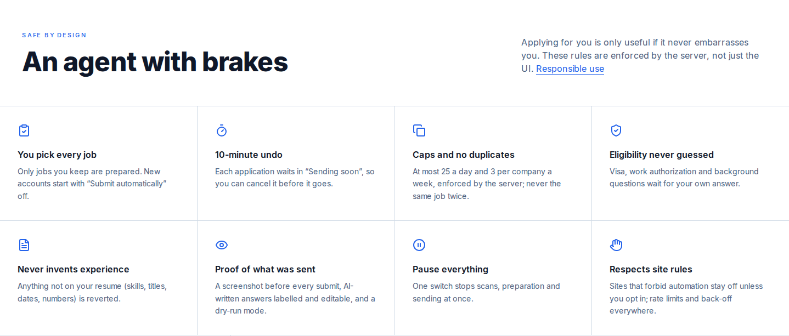</p>

- **You pick every job.** Nothing is prepared for a job you didn't keep, and new accounts start with
  "Submit automatically" off.
- **A 10-minute undo window** on every automatic send, a daily cap (never above 25), at most 3 applications per
  company a week, and never the same job twice.
- **Eligibility is never guessed** and never sent to an AI; **experience is never invented** (a truthfulness
  check reverts anything not on your resume).
- **Job posts are treated as data**, not instructions (prompt-injection defences); every AI reply is
  schema-validated, and each user has a daily AI budget.
- **Proof of what was sent:** a screenshot before every submit, AI-written answers labelled and editable,
  a dry-run mode, and one switch to pause everything.
- **Site rules respected:** sources that forbid automation stay off unless you opt in; per-site rate limits
  and back-off; captchas pause the site.
- **Your data:** secrets encrypted at rest, CSRF and upload checks, PII kept out of logs, download everything
  or delete your account at any time.

Details: [docs/ARCHITECTURE.md](docs/ARCHITECTURE.md#guardrails-and-where-theyre-enforced) ·
[docs/SECURITY.md](docs/SECURITY.md).

## Testing

```bash
make test        # backend suite (pytest), including real-Chromium tests
make e2e-demo    # Playwright through the dashboard in demo mode
make lint        # ruff, ESLint, TypeScript, colour contrast
make metrics     # measure the numbers below
```

Measured with `scripts/metrics.py`, not guessed: **455 backend tests (81% coverage) and 19 end-to-end tests**; on the demo
careers site the first scan takes about 0.3 s, sign-up to the first Swipe Review deck takes under a second of
server time (about 5 s through the UI), and 12 of 12 forms are filled in Chromium with every required field.
CI runs all of it plus migrations, security audits and Docker builds on every push: [docs/TESTING.md](docs/TESTING.md).

## Running it on a server (optional)

HireFlow is built to run on your own computer. To keep it running around the clock (scans every few hours, Gmail
replies tracked live), put it on a server of your own with Docker Compose and automatic HTTPS: one command on a
fresh Ubuntu machine, including Oracle Cloud's free tier. See [docs/SELF_HOSTING.md](docs/SELF_HOSTING.md#on-your-own-server-optional).

## Roadmap

- A 60-second walkthrough video.
- Dedicated submitters for Ashby, SmartRecruiters and iCIMS (today they go through the generic form engine).
- Fair per-user queues and a separate browser-worker pool for many users.
- Browser-extension autofill for applications you fill in yourself.
- More languages and regions beyond the India and US presets.

## Docs

[User guide](docs/USER_GUIDE.md) · [Architecture](docs/ARCHITECTURE.md) · [AI models](docs/AI_MODELS.md) ·
[Free AI with Ollama](docs/OLLAMA.md) ·
[Running and self-hosting](docs/SELF_HOSTING.md) · [Testing](docs/TESTING.md) ·
[Security and responsible use](docs/SECURITY.md) · [The plan](docs/HIREFLOW_PLAN.md)

## License

[MIT](LICENSE)
