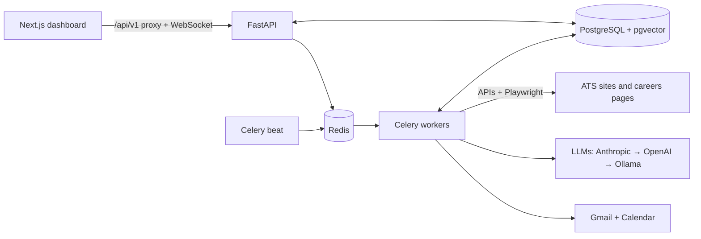

<p align="center">
  
</p>

<h1 align="center">HireFlow</h1>

<p align="center"><b>Swipe right. We apply.</b> An AI internship-application assistant that you run yourself.</p>

<p align="center">
  <a href="https://github.com/saksham-eng560/HireFlow/actions/workflows/ci.yml"></a>
  <a href="docs/TESTING.md"></a>
  <a href="docs/TESTING.md"></a>
  <a href="LICENSE"></a>
  <!-- After deploying (docs/DEPLOY.md), point this badge at the live demo's URL. -->
  <a href="#quick-start"></a>
</p>

HireFlow finds internships, puts every one that passes your filters into a **Swipe Review** deck, and for each
job you keep it tailors your resume (truthfully), writes a cover letter, fills the application form in a real
browser and applies, then tracks the replies from Gmail and puts interviews on your calendar.

**Try it:** `./start.sh --demo` runs the public demo on your machine: one click on **Try the demo**, fictional
companies, nothing really sent. To put a live demo online, follow [docs/DEPLOY.md](docs/DEPLOY.md).
<!-- Live demo: https://<your-demo>.vercel.app · 60-second walkthrough: <video link> (add both after deploying and recording) -->

| Landing | Swipe Review |
|---|---|
|  |  |
| **Overview** | **Ready to submit: check every filled field** |
|  |  |
| **Mass-apply settings** | **Analytics** |
|  |  |

## Features

- **Finds the jobs.** Greenhouse, Lever, Ashby and Workday boards through their public APIs, any careers page
  (schema.org `JobPosting` data), curated internship lists, 107 startup boards with one click, and, only if you
  opt in, LinkedIn, Internshala, Indeed and Glassdoor. Duplicates are merged; scans run every few hours.
- **Swipe Review.** Every job that passed your filters, best match first, with a 0–100 score and why: the
  skills you have, the ones they want, location, term and visa sponsorship. Drag, tap or use ← →; undo any
  swipe; keep everything above a score in one click.
- **Resume tailoring, without inventing anything.** Your original file, light reordering, or full AI
  tailoring checked line by line against your master resume, plus a cover letter for the actual role.
- **Form filling across ATSs.** A real browser fills Greenhouse, Lever, Workday, LinkedIn Easy Apply and
  generic forms, with a screenshot of every filled form. Eligibility questions are never guessed.
- **Gmail and Calendar.** Replies are classified (acknowledged, interview, assessment, rejection, offer) and
  each application's status follows; interviews go on your calendar with prep notes.
- **Analytics.** Pipeline by status, response, interview and offer rates, time to first reply, which platforms
  answer, and the keywords that get callbacks.
- **Onboarding in minutes**, a sample profile to try it, and a guided first scan.

The full tour, with every setting: [docs/USER_GUIDE.md](docs/USER_GUIDE.md).

## Architecture



The API stays fast because everything slow (scans, AI calls, a browser filling a form) runs on Celery queues,
with retries and crash-safe hand-offs. One application's whole journey, why Celery and Playwright, and how the
LLM fallback works: [docs/ARCHITECTURE.md](docs/ARCHITECTURE.md).

## Tech stack

| | |
|---|---|
| Dashboard | Next.js 15, React 19, TypeScript, Tailwind CSS, Radix UI (shadcn/ui), SWR, framer-motion, Recharts |
| API | Python 3.11+, FastAPI, SQLAlchemy 2, Alembic, Pydantic, slowapi |
| Data | PostgreSQL 16 + pgvector (SQLite for local use), Redis, local disk or S3 / Cloudflare R2 |
| Workers | Celery + beat, Playwright (Chromium) |
| AI | Anthropic, OpenAI or Ollama, with JSON-schema outputs and a heuristic fallback |
| Quality | pytest, Playwright e2e, axe-core, ruff, bandit, ESLint, pip-audit, npm audit, gitleaks, GitHub Actions |

## Quick start

```bash
git clone https://github.com/saksham-eng560/HireFlow.git && cd HireFlow
./start.sh --demo      # the demo: press "Try the demo" at http://localhost:3000
./start.sh             # your own agent: sign up and follow the onboarding
```

Needs Python 3.11+ and Node 20+ (macOS, Linux or WSL). The first run creates `.env` with fresh secrets,
installs everything and prepares a local database; later runs start in seconds. `./start.sh --docker` runs the
full stack (PostgreSQL, Redis, workers) in Docker instead, and `./start.sh --ollama` sets up a free local AI
model. Everything works without an AI key, on built-in heuristics; add `ANTHROPIC_API_KEY` to `.env` for the
best results.

More: [running and self-hosting](docs/SELF_HOSTING.md) · [AI models](docs/AI_MODELS.md).

## Guardrails

Applying for someone is only useful if it never embarrasses them. These are enforced by the server, not just
the UI:

- **You pick every job.** Nothing is prepared for a job you didn't keep, and new accounts start with
  "Submit automatically" off.
- **A 10-minute undo window** on every automatic send, a daily cap (never above 25), at most 3 applications per
  company a week, and never the same job twice.
- **Eligibility is never guessed** and never sent to an AI; **experience is never invented** (a truthfulness
  check reverts anything not on your resume).
- **Job posts are treated as data**, not instructions (prompt-injection defences); every AI reply is
  schema-validated, and each user has a daily AI budget.
- **Proof of what was sent:** a screenshot before every submit, AI-written answers labelled and editable,
  a dry-run mode, and one switch to pause everything.
- **Site rules respected:** sources that forbid automation stay off unless you opt in; per-site rate limits
  and back-off; captchas pause the site.
- **Your data:** secrets encrypted at rest, CSRF and upload checks, PII kept out of logs, download everything
  or delete your account at any time.

Details: [docs/ARCHITECTURE.md](docs/ARCHITECTURE.md#guardrails-and-where-theyre-enforced) ·
[docs/SECURITY.md](docs/SECURITY.md).

## Testing

```bash
make test        # backend suite (pytest), including real-Chromium tests
make e2e-demo    # Playwright through the dashboard in demo mode
make lint        # ruff, ESLint, TypeScript, colour contrast
make metrics     # measure the numbers below
```

Measured with `scripts/metrics.py`, not guessed: **432 backend tests (80% coverage) and 9 end-to-end tests**; on the demo
careers site the first scan takes about 0.3 s, sign-up to the first Swipe Review deck takes under a second of
server time (about 5 s through the UI), and 12 of 12 forms are filled in Chromium with every required field.
CI runs all of it plus migrations, security audits and Docker builds: [docs/TESTING.md](docs/TESTING.md).

## Deployment

- **Public demo** (Vercel + Render + Neon + Upstash + Cloudflare R2 + Sentry): [docs/DEPLOY.md](docs/DEPLOY.md).
- **Your own server** (Docker Compose with automatic HTTPS, Oracle Cloud Always Free, AWS):
  [docs/SELF_HOSTING.md](docs/SELF_HOSTING.md#deployment).

## Roadmap

- A live public demo and a 60-second walkthrough video.
- Dedicated submitters for Ashby, SmartRecruiters and iCIMS (today they go through the generic form engine).
- Fair per-user queues and a separate browser-worker pool for many users.
- Browser-extension autofill for applications you fill in yourself.
- More languages and regions beyond the India and US presets.

## Docs

[User guide](docs/USER_GUIDE.md) · [Architecture](docs/ARCHITECTURE.md) · [AI models](docs/AI_MODELS.md) ·
[Self-hosting](docs/SELF_HOSTING.md) · [Deploying the demo](docs/DEPLOY.md) · [Testing](docs/TESTING.md) ·
[Security and responsible use](docs/SECURITY.md) · [The plan](docs/HIREFLOW_PLAN.md)

## License

[MIT](LICENSE)
