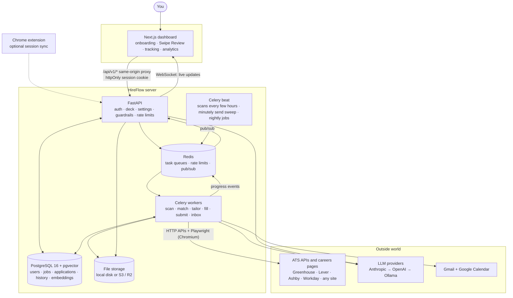
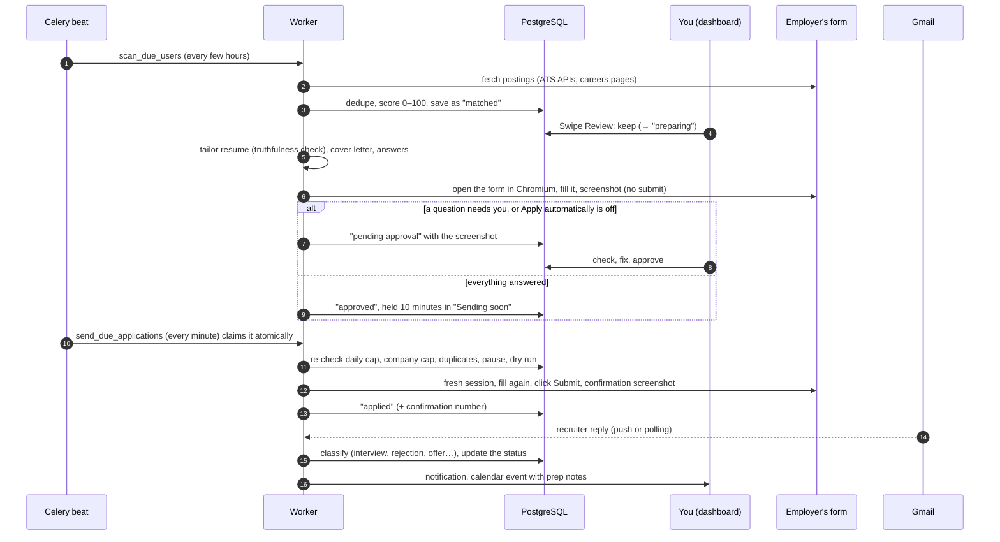

# Architecture

How HireFlow is put together, how one application travels through it, and why it's built this way.
For setup see [SELF_HOSTING.md](SELF_HOSTING.md); for what each feature does, [USER_GUIDE.md](USER_GUIDE.md).

## The pieces



| Piece | Code | What it does |
|---|---|---|
| Dashboard | `frontend/` (Next.js 15, React 19, Tailwind, Radix, SWR, framer-motion) | Every screen. Talks only to its own origin (`/api/v1/*` is proxied to the API), so the session cookie is first-party in every deployment. |
| API | `backend/app/api/` (FastAPI) | Auth, the Swipe Review deck, settings, application actions, the demo careers site. Enforces the guardrails and per-route rate limits, and pushes live updates over a WebSocket. |
| Workers | `backend/app/worker/` (Celery) | Everything slow: scans, AI calls, filling forms in a browser, submitting, reading Gmail. A separate `browser` queue keeps Chromium-heavy work from starving the rest. |
| Scheduler | Celery beat (or `scripts/local_scheduler.py` without Redis) | Scans every few hours, the once-a-minute "send what's due" sweep, Gmail polling, reminders, nightly clean-up and the demo reset. |
| Database | PostgreSQL 16 + pgvector (SQLite locally) | Users, jobs, applications with a full status history, agent runs (the activity log), embeddings for matching. Migrations in `backend/alembic/`. |
| Redis | | Task queues, shared rate-limit state, and pub/sub so a worker's progress reaches the right browser through any API process. |
| Storage | `backend/app/core/storage.py` | Resumes, tailored PDFs and form screenshots, on disk or any S3-compatible store (Cloudflare R2), each under the owner's prefix. |
| Browser automation | `backend/app/automation/`, `backend/app/submitters/` | Playwright sessions, a generic form engine, and submitters for Greenhouse, Lever, Workday, LinkedIn Easy Apply and Internshala. |
| AI layer | `backend/app/services/llm*.py`, `prompts/` | Provider fallback, schema validation, budgets and prompt-injection defences (below). Every step also works without AI, on heuristics. |

## One application, start to finish



The lifecycle is `discovered → matched → preparing → pending approval / approved → applied →
acknowledged → screening → interview → offer` (or `rejected`, `withdrawn`, `failed`). Every change is a
row in `application_status_history` with who made it (`user`, `agent`, `email_parser`), which is also
how the daily cap counts what the agent sent.

**What happens when a worker crashes mid-application?** Tasks are acknowledged only after they finish
(`task_acks_late`) and are re-queued if the worker dies (`task_reject_on_worker_lost`), so Redis hands
the job to another worker. Every task is idempotent: it first checks the application's status and does
nothing if the job was already prepared, undone, skipped or sent. Sending is claimed with an atomic
`UPDATE … WHERE send_after <= now` so two sweeps can never send one application twice. Without Redis
(local mode) tasks run in the API's own threads and die with it, so the minutely sweep also restarts a
preparation that made no progress for 45 minutes, at most twice before marking it failed with a way
forward.

## Why Celery and Redis

Applying is slow and fragile: a scan touches dozens of sites, an AI call can take seconds to minutes
(a local model on a CPU), and a browser filling a multi-step Workday form can take a minute or two.
Doing that inside an HTTP request would tie up API workers, time out at the proxy, and lose the work on
any restart. Queues give:

- **A fast dashboard.** The API answers in milliseconds and the work happens elsewhere; progress streams
  back over the WebSocket.
- **Retries and crash safety** (above), plus per-task time limits so a hung browser can't block a queue.
- **Separate pools.** Browser work runs on its own queue with low concurrency (Chromium is memory-hungry);
  scans and AI calls run in parallel on the default queue.
- **Scheduling** (Celery beat) and **shared state** (rate limits, pub/sub) that works across many API
  and worker processes.

Redis is the broker because it's also the rate-limit store and the pub/sub bus, so one service covers
three needs. For one person on a laptop, Redis is optional: tasks run in-process with the same code
(`backend/app/worker/dispatch.py`) and `scripts/local_scheduler.py` replaces beat.

## Why Playwright

Most application forms are JavaScript apps: Workday is a single-page app, Greenhouse and Lever load
questions dynamically, and many fields only appear after another answer. Plain HTTP can't fill them
reliably, and private ATS APIs aren't available to applicants. A real browser can:

- render the form exactly as a person sees it, then read labels, options and validation messages;
- handle file uploads, custom dropdowns, masked inputs, multi-step flows and follow-up questions;
- take a **screenshot of the filled form**, kept on every application as proof of what was (or would be)
  sent;
- pace typing and clicks like a person and rotate proxies when a site needs it.

Playwright over Selenium for its auto-waiting, reliable file uploads, first-class Python API (the same
language as the rest of the backend) and bundled Chromium. Scans use public ATS JSON APIs and
schema.org `JobPosting` data wherever possible and only fall back to a browser when a site needs one.

**How does it know which ATS a site uses?** From the URL first (`boards.greenhouse.io`,
`jobs.lever.co`, `jobs.ashbyhq.com`, `*.myworkdayjobs.com`, …), then from the page (embedded board
iframes and scripts). Every submitter shares one form engine that reads each field by its label, name
and type; the dedicated ones (Greenhouse, Lever, Workday, LinkedIn Easy Apply) only add each site's quirks,
such as how to open the form or its custom dropdowns, and any other site gets the generic submitter.
Because fields are found by their labels rather than fixed selectors, small HTML changes rarely break it,
and anything it can't fill stops in "pending approval" instead of being guessed.

## How the LLM provider fallback works

`backend/app/services/llm.py`:

1. **Order.** `LLM_PROVIDER=auto` tries Anthropic, then OpenAI, then Ollama (a free local or cloud
   model), whichever are configured. Naming one puts it first; the others stay as fallbacks.
2. **Retries.** Each provider gets 3 attempts with 1 s / 2 s / 4 s back-off on retryable errors
   (rate limits, overload, connection problems).
3. **Structured output.** Every call asks for JSON matching a schema (Claude's structured outputs,
   Ollama's JSON-schema mode). The reply is validated with Pydantic; an unusable reply gets one repair
   round with the same provider, then the next provider is tried.
4. **No provider left?** `LLMUnavailable` is raised and the caller uses its heuristic: keyword resume
   parsing, rule-based scoring, template tailoring and cover letters, rule-based e-mail classification.
   The product works with no AI at all, just less well.
5. **Budget.** Every call is charged to the signed-in user's daily allowance
   (`LLM_CALLS_PER_USER_PER_DAY`, lower in the demo); the meter is in the sidebar. The user is carried
   through request middleware, worker tasks and thread pools by a context variable.

Around every call:

- **Prompt injection.** Job descriptions and web pages are untrusted. They're stripped of hidden text,
  wrapped in `<untrusted_data>` tags, and the system prompt says to treat them as data, never as
  instructions.
- **No fabrication.** A tailored resume may only reorder and reword. `resume_tailor.audit()` compares it
  with the master resume and reverts any employer, title, date, degree, skill or number that isn't there;
  if too much is wrong, the master resume is used instead.
- **Eligibility never goes to the AI.** Visa, work authorization and background questions are answered
  only from your saved answers, or left for you.

## Guardrails, and where they're enforced

| Rule | Where |
|---|---|
| New accounts start with "Submit automatically" off; a 10-minute "Sending soon" window on automatic sends | `services/guardrails.py`, `services/agent_orchestrator.py` |
| Daily cap (your limit, never above 25) and at most 3 applications per company a week | `guardrails.daily_cap_wait`, `guardrails.company_cap_wait`, checked again right before sending |
| Never the same job twice (same link, or same company + title) | `guardrails.duplicate_of` |
| Pause everything; dry run; a screenshot before every submit | `agent_orchestrator.pause_everything`, the `dry_run` preference, the submitters |
| Sources that forbid automation (LinkedIn, Internshala, Indeed, Glassdoor) off until you consent | `services/sources.py` |
| Per-site rate limits, back-off on 429 / Retry-After, captchas pause the site | `services/rate_limiter.py`, `scrapers/base.py` |
| CSRF origin check, HTTPS + HSTS, refusing to start with default secrets in production | `app/main.py`, `config.require_production_ready` |
| Upload checks (size, magic bytes, safe names), owner-only file access, PII-masked logs | `services/uploads.py`, `api/files.py`, `core/log_privacy.py` |
| Demo mode: only the bundled careers site, dry run, real-world actions off | `services/demo_site.py`, `api/deps.NotInDemo` |

## Project structure

```
backend/
  app/
    api/            FastAPI routers (auth, users, onboarding, resumes, jobs, review, applications, agent,
                    communications, interviews, analytics, files/webhooks/WebSocket, demo careers site)
    automation/     Playwright browser sessions, stealth, human emulation, proxies, CAPTCHA
    core/           database, security (JWT, bcrypt, AES-GCM), storage, Redis, WebSocket hub, logging
    models/         SQLAlchemy models (users, resumes, jobs, applications + history, communications, interviews, runs)
    schemas/        Pydantic request/response and resume-content schemas
    scrapers/       Greenhouse, Lever, Ashby, Workday, LinkedIn, Indeed, Glassdoor, Wellfound, Internshala,
                    curated internship lists, generic careers pages, the demo site
    services/       orchestrator, guardrails, LLM client + validation + usage, matcher, tailor + truthfulness
                    audit, cover letters, question answerer, resume parser, PDF generator, Gmail, e-mail
                    parser, calendar, notifier, analytics, rate limiter, privacy, demo seed
    submitters/     Greenhouse, Lever, Workday, LinkedIn Easy Apply, Internshala (opt-in), generic form engine
    worker/         Celery app, beat schedule, tasks, and the in-process fallback
  alembic/          migrations (PostgreSQL)
  tests/            unit, API, scraper-fixture and real-browser tests
frontend/           Next.js dashboard and landing page
e2e/                Playwright tests through the real dashboard in demo mode (scripts/e2e.sh)
extension/          Chrome MV3 extension (LinkedIn and Internshala session sync)
prompts/            every LLM prompt as an editable text file
scripts/            start-up helpers, migrations, seeding, the sample careers site, metrics, smoke test
docs/               these guides, deployment, the plan, screenshots
```

## Scaling past one person

The same design scales by adding processes rather than changing code: more API replicas behind a load
balancer (sessions are stateless JWT cookies; live updates fan out through Redis pub/sub), more default
workers for scans and AI, and a separate pool of browser workers sized by memory. Per-user queues or
fair scheduling would keep one heavy user from delaying others, the per-site rate limiter is already
shared through Redis, and the per-user AI budget bounds cost. At thousands of users the browser pool is
the main cost, so filling only kept jobs (never every match) is what keeps it affordable.
